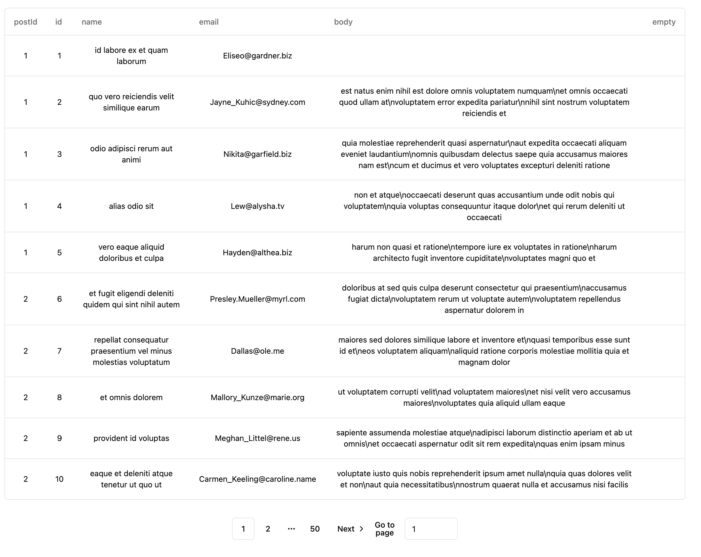

# Introduction
This is simple project build with react and node.js for parsing and displaying data from a csv file.

Current implementation of the project allows the user to upload csv file of any headers and data and display the data in a table format.

Search functionality is also implemented to search the data based on the column headers.

## Installation
open two terminal windows and run the following commands in each terminal window.
```bash
npm install
npm run dev
```

The backend server will run on port 8001 and the frontend server will run on port 5173.

## Web app
### Landing page
You will be greeted with this page on project setup


### Upload a file

Choose a desired csv and click on the `upload` button

### Viewing the file list

After uploading a file, you should be able to see a file name of the csv that you have just uploaded concat with a uuid

### Viewing the file content
Select the desired file to view (if you have multiple)
The file's content will be show in the table below

With the first row being the column and the rest being the data rows.
At the bottom there is a pagination navigation to go through the different pages of the data

### Search

Beside the file list, you can select the header of this csv file and search for the value in this specific header
The search will be performing a `contains` logic with exact sequence match

